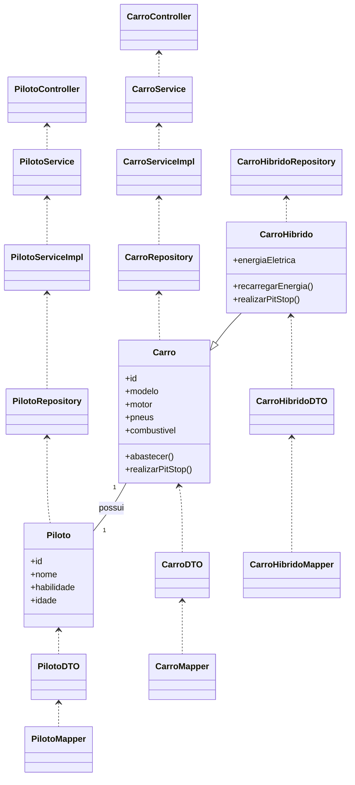

# 24h-lemans-challenge

## Visão Geral

O projeto **24h-lemans-challenge** foi desenvolvido com o objetivo de ensinar e demonstrar, de forma prática e didática, os pilares da Programação Orientada a Objetos (POO) utilizando o universo automobilístico das 24 Horas de Le Mans. Cada elemento da corrida — carros, pilotos, equipes, boxes e engenheiros — é modelado como um objeto, tornando o aprendizado mais intuitivo e conectado à realidade.

---

## Motivação

A analogia com Le Mans facilita a compreensão dos conceitos de POO, pois permite visualizar como classes, objetos, herança, polimorfismo, encapsulamento e abstração se aplicam em situações reais. O projeto serve como base para estudos, aulas, workshops e para quem deseja entender POO de forma aplicada.

---

## Estrutura do Projeto

O projeto está organizado em pacotes, cada um com uma responsabilidade clara, seguindo boas práticas de arquitetura Java/Spring Boot:

- **entity**: Modela os objetos do domínio (Carro, CarroHibrido, Piloto).
- **dto**: Transporta dados entre camadas (CarroDTO, CarroHibridoDTO, PilotoDTO).
- **mapper**: Converte entre entidades e DTOs.
- **repository**: Gerencia a persistência dos dados.
- **service**: Centraliza a lógica de negócio.
- **controller**: Expõe a API REST para interação externa.
- **exception**: Gerencia erros e exceções.

---

## Explicação Didática dos Pilares da POO

### Classes e Objetos
- **Classe**: É o projeto-base, como o desenho de um carro de corrida. Define atributos e métodos comuns.
- **Objeto**: É a instância real, como o Toyota GR010 Hybrid #8 ou o Ferrari 499P #51.

### Herança
- Permite criar especializações, como CarroHibrido que herda de Carro e adiciona energia elétrica.

### Polimorfismo
- Métodos como `realizarPitStop()` podem ser chamados para qualquer carro, mas cada tipo executa sua lógica específica.

### Encapsulamento
- Protege dados críticos, como combustível, permitindo alterações apenas por métodos controlados.

### Abstração
- Foca no essencial, como acelerar, frear ou fazer pit stops, sem expor detalhes internos.

---

## Funcionamento da Aplicação

1. Usuário faz uma requisição via API REST (ex: criar um carro híbrido).
2. Controller recebe a requisição e chama o serviço correspondente.
3. Serviço valida os dados, aplica regras de negócio (ex: verifica se o piloto existe, abastece o carro).
4. Mapper converte DTO em entidade para persistência.
5. Repositório salva ou consulta o objeto no banco de dados.
6. Mapper converte entidade em DTO para resposta.
7. Controller retorna a resposta ao usuário.

---

## Diagrama da Estrutura (Mermaid)



---

## Exemplos Práticos de POO no Projeto

- **Instanciando objetos**: Cada carro e piloto é um objeto com atributos próprios.
- **Especialização**: CarroHibrido é um tipo especial de Carro, com energia elétrica.
- **Polimorfismo**: O método `realizarPitStop()` pode ser chamado para qualquer carro, e cada tipo executa sua lógica específica.
- **Encapsulamento**: O combustível só pode ser alterado por métodos controlados, protegendo a integridade dos dados.

---

## Como Executar

1. Certifique-se de ter o Java 17+ e Maven instalados.
2. Execute o comando:
   ```
   ./mvnw spring-boot:run
   ```
3. Acesse a API via [http://localhost:8080](http://localhost:8080)

---

## Testando com Swagger e Postman

- O projeto pode ser facilmente integrado ao Swagger para documentação automática da API.
- Para testar endpoints, utilize o Swagger UI ou importe o arquivo JSON no Postman.

---

## Conclusão

O **24h-lemans-challenge** é um exemplo prático e educativo de Programação Orientada a Objetos, com estrutura clara, separação de responsabilidades e modelagem fiel ao domínio da corrida de Le Mans. Ideal para quem deseja aprender POO de forma aplicada e divertida!
